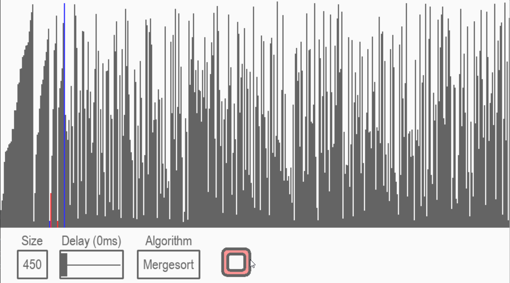

# Sorting-Algorithms-Visualizer 
Program made with Python and Pygame module for visualizing sorting algorithms
 
Support this project by leaving a :star:

Check [Wiki Page](../../wiki) for more information about each algorithm, as visualization gifs and explanations.

Visit [repository github page](https://lucaspilla.github.io/Sorting-Algorithms-Visualizer/)

## Program preview

### New Features
|Selecting an algorithm ([@yuchenliu15](https://github.com/yuchenliu15)) |Pause and Play with \<SPACE\> ([@system1970](https://github.com/system1970)) |
|---|---|
|||

## Using the application
  :exclamation: Feel free to open an issue if you have some problem :exclamation:
- Clone GitHub repository
- Install requirements: `pip install -r requirements.txt`
- Run: `python main.py`

## How to contribute: 
- Implement new Algorithms or ideas
- Report bugs and give feedbacks
